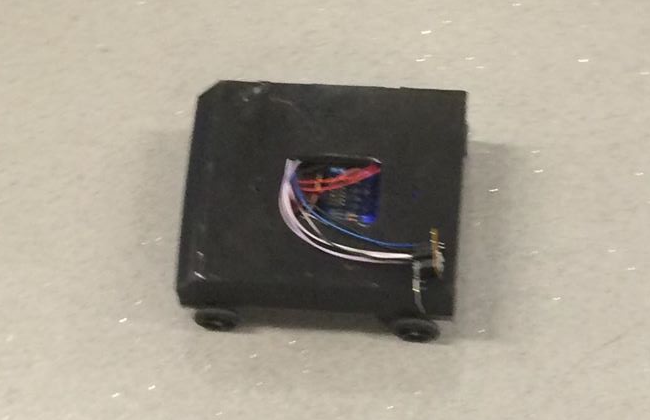
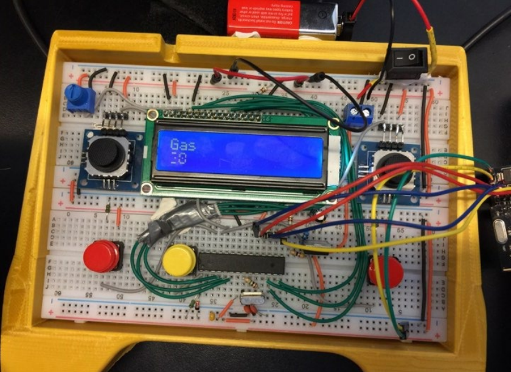
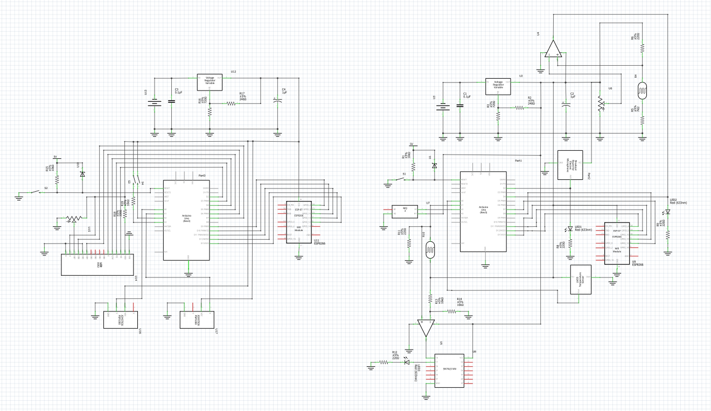
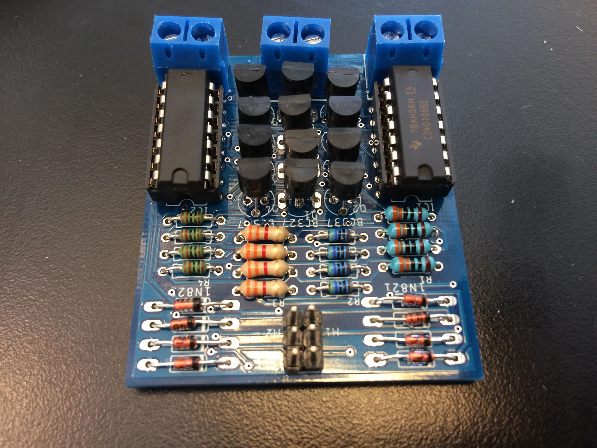
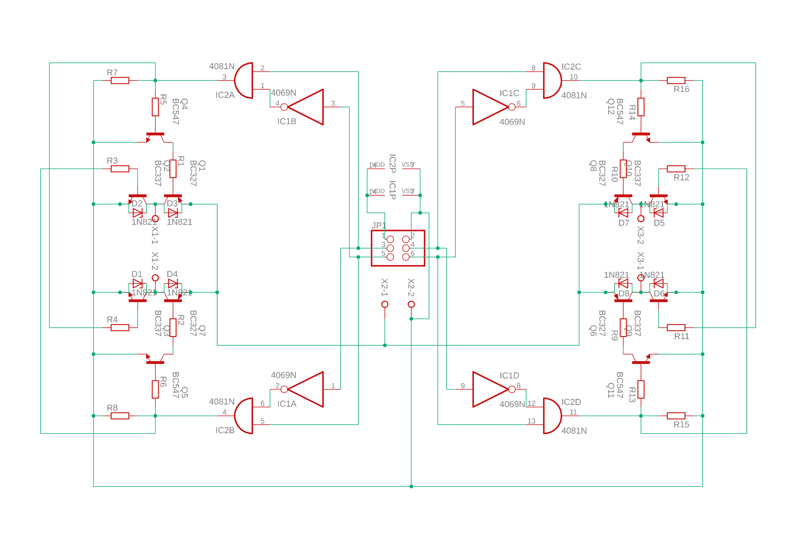

# Arduino RC sensor car 
A radio controlled car which collects sensor data. Made for an electronics class.
| Car                  | Controller                         |
|----------------------|------------------------------------|
|  |  |

## Schematics

Pin 6, 7, 9 and 10 of the microcontroller are connected to a dual H-bridge

| H-bridge                      | Schematic                              |
|-------------------------------|----------------------------------------|
|  |  |
